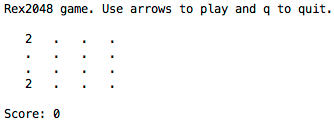

# Rex2048

An elixir terminal implementation of the [2048 game](http://2048game.com/). It was made as en exercise to learn the language.



Inspired by [github.com/lexmag](https://github.com/lexmag/tty2048), but the implementation is my own.

## Building

Build standalone escript:

```sh
$ mix deps.get
$ mix escript.build
```

## Playing

Run the executable.
```sh
$ ./rex2048
```
